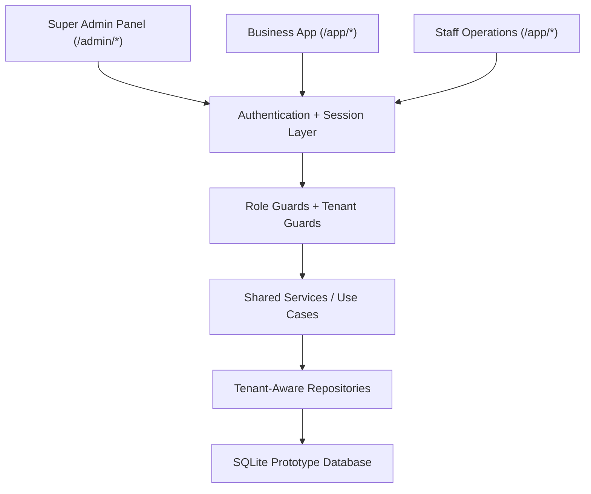

# Multi-Tenant SaaS Architecture

This document defines the target architecture for the POS platform after the multi-tenant and Super Admin upgrade.

## Architecture Goals

- Support multiple businesses securely on a shared application backend
- Preserve strict tenant isolation
- Support separate platform and tenant administration
- Keep the prototype SQLite-friendly while staying SaaS-ready
- Enforce authorization consistently in UI, API, service, and data access layers

## High-Level Topology



## Logical Layers

### 1. Super Admin Layer

- Separate login page and session scope
- Dedicated admin layout and sidebar
- Platform-wide dashboards, security monitoring, business management, and reports
- Access limited to users with role `super_admin`

### 2. Tenant or Business Layer

- Business Owner dashboard and management screens
- Tenant-specific reporting, settings, stock, products, sales, customers, and credit
- Access limited to users with role `business_owner` and matching `business_id`

### 3. Staff Layer

- Operational pages only
- Sales recording, product viewing, stock operations, and optionally customer creation during sale
- No access to owner-only analytics, settings, or platform pages

### 4. Shared Application Backend

- Shared controllers or route handlers
- Shared service layer for products, stock, sales, credit, users, and admin analytics
- Shared audit and security logging

### 5. Data Layer

- One prototype SQLite database
- Every business-scoped table includes `business_id`
- Platform-only tables remain global
- Composite keys and repository conventions reduce cross-tenant leakage risk

## Route Segmentation

### Admin Routes

- `/admin/login`
- `/admin/dashboard`
- `/admin/businesses`
- `/admin/businesses/:businessId`
- `/admin/users`
- `/admin/owners`
- `/admin/staff`
- `/admin/analytics/sales`
- `/admin/analytics/revenue`
- `/admin/analytics/credit`
- `/admin/security`
- `/admin/audit-logs`
- `/admin/settings`
- `/admin/announcements`
- `/admin/reports`

### Tenant Routes

- `/auth/login`
- `/app/dashboard`
- `/app/products`
- `/app/categories`
- `/app/stock`
- `/app/customers`
- `/app/sales`
- `/app/repayments`
- `/app/reports`
- `/app/staff`
- `/app/settings`

## Request Context Contract

Every authenticated request should carry a normalized security context:

- `user_id`
- `role`
- `business_id` nullable only for `super_admin`
- `session_scope` such as `admin` or `tenant`
- `permissions` derived from role

This context should be resolved once in middleware and passed into services instead of being recomputed ad hoc.

## Authorization Model

### Required Guards

- `requireAuthenticated()`
- `requireAdmin()`
- `requireTenantUser()`
- `requireOwnerOrAdmin()`
- `requireSameBusiness(resourceBusinessId, context.business_id)`

### Enforcement Rules

- `super_admin` can access platform routes and platform analytics only.
- `business_owner` can access only records belonging to their own `business_id`.
- `staff` can access only operational tenant routes allowed by policy.
- Any resource fetch by ID must also validate `business_id` unless the resource is platform-global.

### URL Tampering Protection

Do not load tenant resources by primary key alone.

Use patterns like:

```sql
SELECT *
FROM products
WHERE product_id = :product_id
  AND business_id = :business_id;
```

Avoid patterns like:

```sql
SELECT *
FROM products
WHERE product_id = :product_id;
```

## Data Access Strategy

Repositories should be tenant-aware by design.

### Tenant-Scoped Repository Convention

- Tenant repositories receive `businessId` as a required argument.
- Query helpers always bind `business_id`.
- Write operations inject `business_id` from the authenticated context, not from untrusted client input.
- Admin analytics repositories are the only place allowed to aggregate across businesses.

### Example Service Pattern

1. Authenticate request and build request context.
2. Authorize by role.
3. Inject `business_id` from context for tenant operations.
4. Use repository methods that require `businessId`.
5. Log the action to tenant or platform audit logs.

## Database Design Summary

### Global Tables

- `businesses`
- `platform_audit_logs`
- `login_attempts`
- `security_events`
- `platform_notifications`
- `global_settings`
- `support_requests`

### Tenant-Scoped Tables

- `users` for business owners and staff
- `categories`
- `products`
- `stock_batches`
- `customers`
- `sales`
- `sale_items`
- `repayments`
- `audit_logs`
- `settings`

### Tenant Integrity Principles

- Every tenant table stores `business_id`
- Tenant tables use composite uniqueness such as `(business_id, record_id)` to support safer foreign keys
- Domain relationships should reference both `business_id` and record identifier whenever possible
- Super Admin users are global and should never be mixed into tenant queries except for audit attribution

## Authentication and Session Design

### Recommended Approach

- Separate admin login page and tenant login page
- Session payload stores `user_id`, `role`, `business_id`, and `session_scope`
- Rotate session on login
- Invalidate suspended users and suspended businesses at request time

### Failure Handling

- Log failed login attempts
- Track source IP and user agent
- Emit security events for repeated failures, blocked access, or suspicious admin actions

## Audit and Monitoring

### Tenant Audit Logs

Track tenant-level actions such as:

- product creation or update
- stock adjustment
- sale creation
- repayment recording
- customer changes
- staff management

### Platform Audit Logs

Track admin actions such as:

- business creation
- business approval or suspension
- owner password reset
- global setting change
- announcement publishing
- report export

### Security Events

Track:

- failed logins
- repeated failed logins
- forbidden route access
- suspicious cross-tenant access attempts
- session anomalies

## Analytics Architecture

### Super Admin KPIs

- Total Businesses
- Active Businesses
- Suspended Businesses
- Total Users
- Total Owners
- Total Staff
- Total Sales
- Total Revenue
- Total Gross Profit
- Total Realized Profit
- Total Unrealized Profit
- Total Credit Outstanding
- Low Stock Alerts
- Near Expiry Alerts
- Expired Batches

### Business Profile Summary

Each business detail page should present:

- account metadata and status
- owner and contact information
- user counts
- catalog and stock volume
- sales and revenue totals
- credit risk and overdue exposure
- recent activity
- recent transactions
- latest login information

## UI and UX Direction

### Admin Navigation

- Dashboard
- Businesses
- Users
- Owners
- Staff
- Analytics
- Security
- Audit Logs
- Settings
- Announcements
- Reports

### Visual Design Expectations

- Clean sidebar with clear active states
- Summary cards with status color hierarchy
- Filterable data tables with search and quick actions
- Risk badges for suspended or overdue businesses
- Responsive grid for charts and KPI cards
- Professional palette shared with the rest of the platform

## Scalability Path

Although the prototype uses SQLite, the architecture should make future upgrades straightforward.

### Design Choices That Support Scale

- Shared service layer independent of UI layout
- Repository abstraction for tenant-aware querying
- Explicit request context carrying `business_id`
- Platform-global tables separated from tenant-scoped tables
- Audit and security logging modeled from the beginning

### Future Upgrade Path

- Move from SQLite to PostgreSQL or MySQL
- Add background jobs for analytics and notifications
- Introduce caching for platform dashboards
- Split admin and tenant frontends if scale requires

## Implementation Checklist

- Add `businesses` model and tenant-aware relationships
- Add `role` and `business_id` to auth model
- Separate admin and tenant route groups
- Enforce route and service guards
- Build platform analytics queries and business summary queries
- Log admin, tenant, and security events
- Prevent cross-tenant access in all handlers and exports
